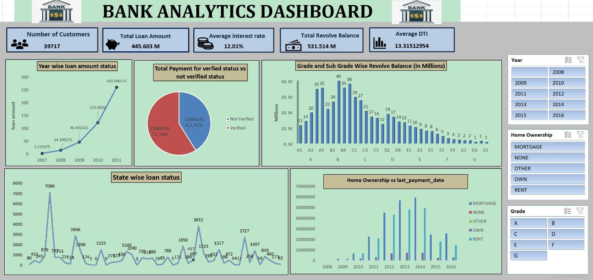
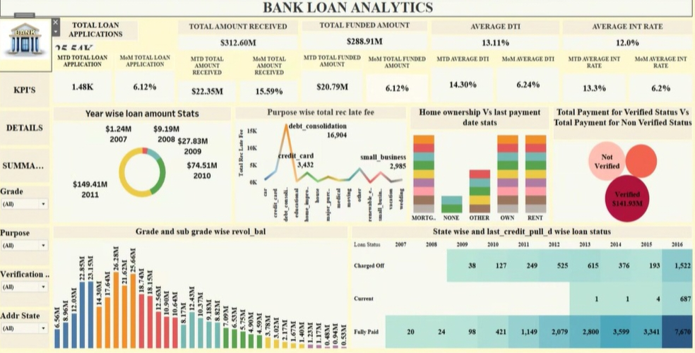

# Bank Loan Data Analysis

A bank loan data analysis project using Excel, Power BI, Tableau, and MySQL.

## Tools Used

- Excel
- Power BI
- Tableau
- MySQL

## Project Work

- Data cleaning and analysis
- KPI analysis using MySQL
- Dashboard creation
- Data visualization
- Loan data analysis

## MySQL Analysis

The SQL file contains queries used to calculate and analyze the project KPIs.

[View MySQL Queries](MySQL/Bank-Analysis.sql)

## Dashboards

### Excel Dashboard

### Power BI Dashboard

### Tableau Dashboard

